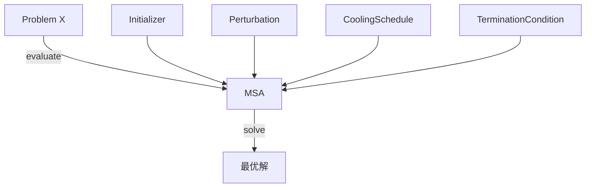

# Modular Simulated Annealing (MSA)

[](https://www.java.com)

一个严格遵循 **最少信息原则** 的模块化模拟退火算法框架。  
将算法拆解为 **初始化、扰动、冷却、终止** 四大可替换组件，像乐高一样自由组合。

## ✨ 设计思想

### 为什么还要造轮子？

现有实现要么是工业级黑盒（如 Optuna），要么是高度耦合的教学代码。  
**MSA** 面向学习、实验和定制化：每一块组件都拥有清晰的接口契约，可以独立阅读、测试和替换。

### 核心原则：最少信息

组件的接口**只传递它绝对无法自行推导的信息**。

| 不传递 | 原因 |
|--------|------|
| 目标函数值 `value` | 组件可通过 `Problem.evaluate()` 自行获取 |
| 是否改进 `isImproved` | 组件可自行比较前后解的值 |
| 迭代次数 | 组件内部维护计数器，通过 `check()` / `perturb()`/`cool()` 被调用次数推导 |

**只传递三样原子事实**：
1. `temperature` – 只有主循环知道
2. `current` – 当前解（组件无法感知外部状态）
3. `isAccepted` – 上一次概率接受的结果（只有主循环拥有随机数）

### 架构概览



## 📁 项目结构

msa/
├── README.md
├── .gitignore
└── msa/
    ├── core/                # 框架核心：抽象接口与算法主控
    │   ├── Problem.java
    │   ├── Initializer.java
    │   ├── Perturbation.java
    │   ├── CoolingSchedule.java
    │   ├── TerminationCondition.java
    │   └── ModularSimulatedAnnealing.java
    ├── components/          # 可替换的基础实现
    │   ├── BasicInitializer.java
    │   ├── BasicPerturbation.java
    │   ├── BasicCoolingSchedule.java
    │   └── BasicTerminationCondition.java
    ├── problem/             # 优化问题示例
    │   └── RosenbrockProblem.java
    └── examples/            # 可运行的示例
        └── RosenbrockDemo.java

## 🚀 快速开始

```java
ContinuousProblem problem = new MyProblem(2);// 定义问题
ModularSimulatedAnnealing<double[],ContinuousProblem> msa = 
new ModularSimulatedAnnealing<double[],ContinuousProblem>(
    problem,
    new BasicInitializer(100),
    new BasicPerturbation(),
    new BasicCoolingSchedule(0.99,100),
    new BasicTerminationCondition(10000)
);// 组装组件
double[] x = msa.solve();// 启动算法
System.out.println(problem.evaluate(x));// 输出最优解目标值
```

## 🧩 自定义组件

所有组件只需继承对应的抽象类并实现核心方法。
以下是一个线性冷却策略示例：

```java
public class BasicCoolingSchedule extends CoolingSchedule<double[],ContinuousProblem> {
    private double coolingRate;
    private int currentIteration;
    private int maxIterations;
    
    public BasicCoolingSchedule(double coolingRate, int maxIterations) {
        this.coolingRate = coolingRate;
        this.maxIterations = maxIterations;
        this.currentIteration = 0;
    }
    
    @Override
    public void init(ContinuousProblem problem) {
        // 初始化操作
    }
    
    @Override
    public double cool(double temperature, double[] x,boolean isAccepted) {
        currentIteration++;
        if(currentIteration > maxIterations) {
            currentIteration = 0;
            return temperature * coolingRate;
        }
        return temperature;
    }
}
```

## 🎯 自定义问题

要让 MSA 优化你的问题，只需创建一个类实现 `Problem<X>` 接口，
其中 `X` 是你对解的表示方式（例如 `double[]`、`int[]` 或自定义结构）。

### 1. 实现核心方法

```java
import msa.examples.ContinuousProblem;

public class MyProblem extends ContinuousProblem {

    public MyProblem(int dimension) {
        super(createBounds(dimension, -100), createBounds(dimension, 100));
    }

    /**
     * 目标函数：越小越优。
     * 实现必须为纯函数（相同输入 -> 相同输出）。
     */
    @Override
    public double evaluate(double[] x) {
        double sum = 0.0;
        for (double v : x) {
            sum += v * v;   // 示例：简单的平方和函数
        }
        return sum;
    }

    /**
     * 深拷贝解。
     * 可简单使用 clone()（如果类型支持）或手动复制。
     */
    @Override
    public double[] copyX(double[] x) {
        return x.clone();
    }

    private static double[] createBounds(int dim, double value) {
        double[] bounds = new double[dim];
        java.util.Arrays.fill(bounds, value);
        return bounds;
    }
}
```

## 2. 传入框架

详情见**快速开始**章节。

## 3. 性能建议：为评估添加缓存
如果评估代价较高（例如需要大量计算或数据库查询），
建议在 Problem 实现类内部引入缓存，避免算法或组件重复计算同一个解。

简单缓存策略（按需使用）：

```java
import java.util.Arrays;

public class CachedMyProblem implements Problem<double[]> {
    private double[] lastX = null;
    private double lastValue = 0.0;

    @Override
    public double evaluate(double[] x) {
        // 如果与上次评估的解完全相同，直接返回缓存值
        if (lastX != null && Arrays.equals(x, lastX)) {
            return lastValue;
        }
        // 否则进行全量评估，并更新缓存
        double value = 0.0;
        for (double v : x) {
            value += v * v;
        }
        lastX = x.clone();
        lastValue = value;
        return value;
    }

    @Override
    public double[] copyX(double[] x) {
        return x.clone();
    }
}
```

## ⚠️ 冷启动约定：首次调用组件时 isAccepted 为 false，且尚无历史迭代。

组件必须将此视为“无历史记录”，采用默认保守策略（例如固定步长、默认冷却因子）。

## 📖 设计约束

冷启动：第一个迭代周期中，isAccepted 被硬编码为 false，不代表真实事件。

线程安全：框架默认单线程运行，所有组件内部可变状态需自行同步。

不可变性：传入组件的 currentX 解不应被原地修改；扰动方法必须返回新对象。

最少信息：组件的接口已经过严格筛选，如需额外信息（如目标函数值），请通过注入的 Problem 实例自行获取并缓存。

## 🔮 未来演进

离散问题适配示例（TSP、背包）

提供缓存功能的快速上手示例。

## 📄 许可

本项目采用 【MIT License】 许可证，详见 LICENSE 文件。

欢迎 Issue 和 PR。如果你也喜欢“让代码自己说话”的风格，这个项目就是为你准备的。
